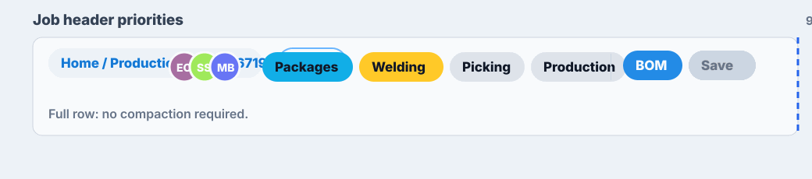
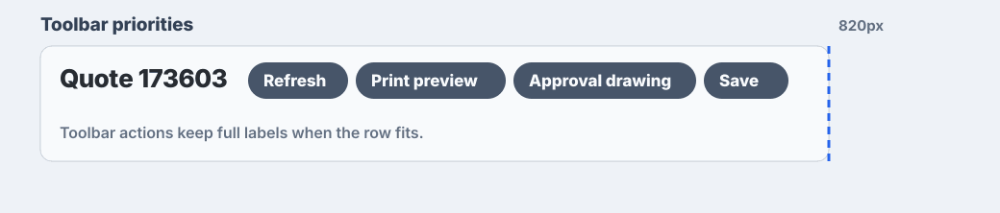

# react-priority-overflow-row

A measured React layout primitive for rows where siblings have their own
responsive representations and must coordinate before wrapping.

It is useful for headers, toolbars, and dense operational UI where each child
can become smaller in a different way:

- breadcrumbs can switch from full text to compact text;
- chips can switch from full labels to short labels to icon-only;
- action buttons can switch from button to icon button;
- one group can move to its own line after lower-cost compaction is exhausted.



## Install

```sh
npm install react-priority-overflow-row
```

Install peer dependencies if your app does not already provide them:

```sh
npm install react react-dom
```

## Quick Start

```tsx
import { PriorityOverflowRow } from 'react-priority-overflow-row';

export function Header() {
  return (
    <PriorityOverflowRow gap={12}>
      <PriorityOverflowRow.Group>
        <PriorityOverflowRow.Variant
          modes={[
            { value: 'full' },
            { value: 'compact', priority: 10 },
          ] as const}
        >
          {(mode) => <Breadcrumbs mode={mode} />}
        </PriorityOverflowRow.Variant>
        <QuoteChip />
      </PriorityOverflowRow.Group>

      <PriorityOverflowRow.Group align="end" wrapPriority={100}>
        <PriorityOverflowRow.Variant
          modes={[
            { value: 'full' },
            { value: 'short', priority: 20 },
            { value: 'icon', priority: 80 },
          ] as const}
        >
          {(mode) => <JobChips mode={mode} />}
        </PriorityOverflowRow.Variant>

        <PriorityOverflowRow.Variant
          modes={[
            { value: 'full' },
            { value: 'icon', priority: 40 },
          ] as const}
        >
          {(mode) => <HeaderActions mode={mode} />}
        </PriorityOverflowRow.Variant>
      </PriorityOverflowRow.Group>
    </PriorityOverflowRow>
  );
}
```

## Mental Model

`PriorityOverflowRow` makes the parent own the negotiation. You describe the
real row structure, and each responsive child declares its own modes.

The row then:

1. Measures every group in every possible local mode state.
2. Starts with every variant in its first mode.
3. If the line does not fit, applies the lowest-priority available compaction.
4. Wraps a group only when wrapping is cheaper than any remaining compaction.
5. Re-solves each wrapped line independently.

Lower priority numbers compact earlier. Mode order is still meaningful: list
modes from most expansive to most compact.

## API

### `PriorityOverflowRow`

| Prop | Type | Description |
| --- | --- | --- |
| `gap` | `number \| string` | Gap between groups and wrapped lines. Numbers are CSS pixels. |
| `children` | `ReactNode` | Use `PriorityOverflowRow.Group` children. |
| `className` | `string` | Optional root class name. |
| `style` | `CSSProperties` | Optional root inline style. |

### `PriorityOverflowRow.Group`

| Prop | Type | Description |
| --- | --- | --- |
| `align` | `'start' \| 'end'` | `end` pins the group to the end of its current line. |
| `gap` | `number \| string` | Gap between children inside the group. Defaults to the row gap. |
| `wrapPriority` | `number` | Cost to move the group to its own line. Omit to prevent independent wrapping. |
| `children` | `ReactNode` | Fixed children and `Variant` children. |

### `PriorityOverflowRow.Variant`

| Prop | Type | Description |
| --- | --- | --- |
| `modes` | non-empty mode array | Modes ordered from most expansive to most compact. |
| `children` | `(mode) => ReactNode` | Render prop that receives the selected mode. |

Each mode is:

```ts
type PriorityOverflowMode<Mode extends string> = {
  value: Mode;
  priority?: number;
};
```

The first mode should not need a priority because it is the starting state.
Later modes use `priority` as the cost to enter that smaller representation.

## Tutorial

### 1. Split the row into meaningful groups

Groups should match visual units that should stay together.

```tsx
<PriorityOverflowRow.Group>
  <Breadcrumbs />
  <QuoteChip />
</PriorityOverflowRow.Group>

<PriorityOverflowRow.Group align="end" wrapPriority={100}>
  <People />
  <StatusChips />
  <Actions />
</PriorityOverflowRow.Group>
```

### 2. Wrap only the children that can change representation

Raw children are measured as fixed content. Use `Variant` only when a child has
multiple representations.

```tsx
<PriorityOverflowRow.Variant
  modes={[
    { value: 'full' },
    { value: 'short', priority: 20 },
    { value: 'icon', priority: 80 },
  ] as const}
>
  {(mode) => <StatusChips mode={mode} />}
</PriorityOverflowRow.Variant>
```

### 3. Tune priorities by product intent

The numbers do not need to be contiguous. Leave room between them.

```tsx
// Breadcrumbs compact before status chips lose labels.
{ value: 'compact', priority: 10 }

// Status chips shorten before action buttons become icons.
{ value: 'short', priority: 20 }

// Actions become icons before status chips become icon-only.
{ value: 'icon', priority: 40 }
```

### 4. Let wrapping re-expand the new line

Set `wrapPriority` on the group that may move to its own line. After wrapping,
that line starts from expansive modes again and compacts only if its own line is
too narrow.



## Running This Repository

```sh
npm install
npm run dev
npm test
npm run typecheck
npm run build
```

Regenerate README GIFs:

```sh
npm run docs:gifs
```

## Examples

The Vite demo lives in `examples/basic`.

```sh
npm run dev
```

Open the printed local URL and resize the demo frames.

More examples are documented in [docs/examples.md](docs/examples.md).

## Notes

- This library does not move items into an overflow menu.
- It does not invent aggregate mode names like `compact-actions` or `wrapped`.
- It measures real rendered DOM widths, so translations, fonts, and content
  length are part of the decision.
- If the final compact modes still cannot fit, the line is allowed to overflow
  normally. The library does not hide content to fake a fit.
